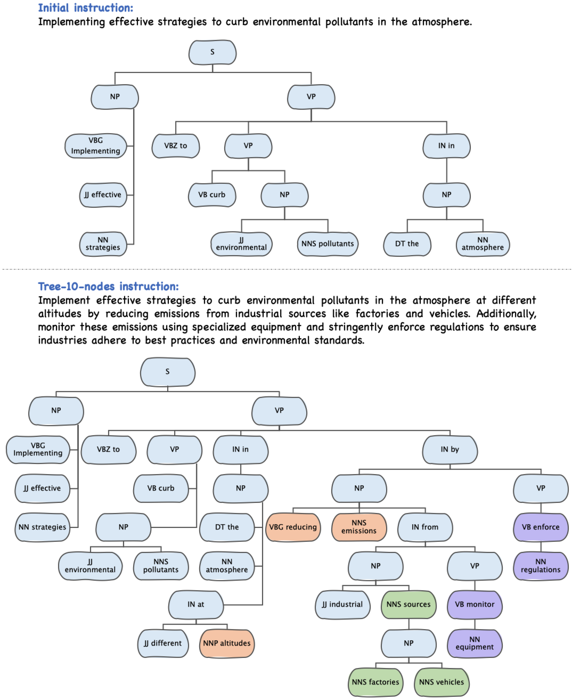

## Overview
**Tree-Instruct**, a novel approach to systematically enhance the instruction complexity in a controllable manner. By adding a specified number of nodes to instructions’ semantic trees, this approach not only yields new instruction data from the modified tree but also allows us to control the difficulty level of modified instructions. 

Our preliminary experiments reveal the following insights: (1) Increasing complexity consistently leads to sustained performance improvements of LLMs. (2) Under the same token budget, a few complex instructions outperform diverse yet simple instructions. (3) Curriculum instruction tuning might not yield the anticipated results; focusing on increasing complexity appears to be the key.


## Data Construction
We randomly select 1000 samples from the Alpaca-gpt4 dataset as the original instruction data (DATA/alpaca1k_original). Then we construct more complex instructions through Tree-Instruct by adding a specified number of nodes to the semantic tree of the original instruction.

```bash
python generate_tree_instructions.py # generate new instructions through Tree-Instruct
python generate_tree_responses.py # generate responses for new instructions
```

## Model Training and Evaluation
We refer to the repository of [OpenChat](https://github.com/imoneoi/openchat) to implement the training and inference of LLaMA2-13B with the constructed dataset. We also provide our scripts for your reference.

## Citation 
If you finding our work interesting or helpful to you, please cite this repository:
```  
@article{zhao2023preliminary,
      title={A Preliminary Study of the Intrinsic Relationship between Complexity and Alignment},
      author={Yingxiu Zhao and Bowen Yu and Binyuan Hui and Haiyang Yu and Fei Huang and Yongbin Li and Nevin L. Zhang},
      year={2023},
      eprint={2308.05696},
      archivePrefix={arXiv},
}
```